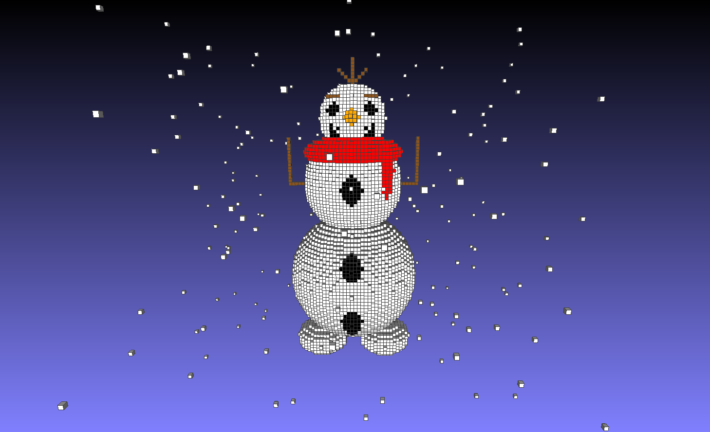

# 🧊 Sculptor 3D

[](https://isocpp.org/)
[]()

**Sculptor 3D** é uma ferramenta de linha de comando desenvolvida em C++ para modelagem tridimensional baseada em voxels. A aplicação interpreta um script de texto para criar esculturas digitais e exportá-las no formato `.OFF`, compatível com visualizadores 3D como MeshLab e Geomview.

O repositório demonstra a evolução do projeto em duas fases, partindo de uma implementação direta para uma arquitetura flexível com **Polimorfismo e Herança**.

---

## 📋 Tabela de Conteúdos

* [Sobre o Projeto](#-sobre-o-projeto)
* [As Duas Fases do Projeto](#-as-duas-fases-do-projeto)
* [Galeria de Exemplos](#-galeria-de-exemplos)
* [Principais Funcionalidades](#-principais-funcionalidades)
* [Tecnologias Utilizadas](#-tecnologias-utilizadas)
* [Como Compilar e Executar](#-como-compilar-e-executar)
* [Formato do Arquivo de Script (Parte 2)](#-formato-do-arquivo-de-script-parte-2)
* [Agradecimentos](#-agradecimentos)
* [Autor](#-autor)

---

## 📖 Sobre o Projeto

Este projeto foi desenvolvido para a disciplina de **Programação Avançada (DCA3303)** do curso de Engenharia da Computação da UFRN. A proposta é criar uma ferramenta em C++ para realizar **esculturas digitais** em um espaço tridimensional, de forma similar à lógica de blocos do jogo **Minecraft**.

---

## 🚀 As Duas Fases do Projeto

O desenvolvimento foi dividido em duas partes distintas para demonstrar diferentes abordagens de implementação:

### Parte 1: Implementação Direta
A primeira versão do `Sculptor` é construída com chamadas diretas às funções de desenho dentro do próprio código `main.cpp`. É uma abordagem simples e eficaz para testar a lógica principal de manipulação da matriz de voxels e a geração do arquivo `.OFF`.

### Parte 2: Arquitetura com Polimorfismo
A segunda versão evolui o conceito, aplicando **Herança** e **Polimorfismo**. Foi criada uma classe base abstrata `FiguraGeometrica` e classes derivadas para cada forma (`PutVoxel`, `PutBox`, `CutSphere`, etc.). O programa agora lê um arquivo de texto, instancia os objetos de forma polimórfica e os armazena em uma lista. Por fim, ele percorre a lista e executa o método `draw()` de cada objeto, "desenhando" a figura na matriz do Sculptor.

Essa abordagem torna o sistema **extensível** (novas formas podem ser adicionadas facilmente) e **flexível**, desacoplando a lógica de leitura dos comandos da ação de desenhar.

---

## 🎨 Galeria de Exemplos

A criatividade é o essencial para criar qualquer coisa nesse projeto. Abaixo, um exemplo de um boneco de neve inspirado no Olaf, da animação Frozen, criado com a **Parte 2** do projeto.



---

## ✨ Principais Funcionalidades

-   Criação de uma matriz 3D de voxels com dimensões personalizadas.
-   Escultura aditiva (`put`) e subtrativa (`cut`) de voxels.
-   Uso de primitivas geométricas como Voxel, Box, Sphere e Ellipsoid.
-   Definição de cores (RGBA) para cada primitiva.
-   **Duas abordagens de execução:** via código (`main`) ou via arquivo de script com polimorfismo.
-   Exportação do modelo 3D final no formato `.OFF`.

---

## 🛠️ Tecnologias Utilizadas

* **C++:** Linguagem de programação principal.
* **Orientação a Objetos:** Conceitos de Herança e Polimorfismo são aplicados na Parte 2.
* **Make/g++:** Sistema de build para compilação do código-fonte.

---

## 🚀 Como Compilar e Executar

Siga os passos de acordo com a parte do projeto que deseja executar.

### Pré-requisitos
* Compilador C++ (g++)
* Git (para clonar o repositório)

### Parte 1: Construção via Código

Nesta parte, você edita o `main.cpp` para criar sua escultura.

1.  **Acesse o diretório da Parte 1** (se estiver separado).
2.  **Edite o arquivo `main.cpp`** com as chamadas de função desejadas.
    ```cpp
    // Exemplo de main.cpp para a Parte 1
    #include "sculptor.h"

    int main() {
        // Cria um espaço de 50x50x50
        Sculptor s(50, 50, 50);
        
        // Define a cor para vermelho
        s.setColor(1.0, 0.0, 0.0, 1.0);
        
        // Desenha uma caixa
        s.putBox(5, 45, 5, 45, 5, 45);
        
        // Escreve o resultado no arquivo .off
        s.writeOFF("saida_parte1.off");
        
        return 0;
    }
    ```
3.  **Compile o código:**
    ```sh
    g++ main.cpp sculptor.cpp -o sculptor_p1
    ```
4.  **Execute:**
    ```sh
    ./sculptor_p1
    ```
    Isso irá gerar o arquivo `saida_parte1.off`.

### Parte 2: Construção via Arquivo de Script (com Polimorfismo)

Esta versão lê os comandos de um arquivo de texto.

1.  **Acesse o diretório da Parte 2** (ex: `Sculptor3D_Parte2/`).
2.  **Compile o código:** Você precisará incluir todos os arquivos `.cpp` das figuras.
    ```sh
    # O comando pode variar dependendo dos nomes dos seus arquivos.
    g++ main.cpp sculptor.cpp putvoxel.cpp cutvoxel.cpp ... -o sculptor_p2
    ```
3.  **Crie um arquivo de script** (ex: `meu_desenho.txt`) com os comandos.
4.  **Execute o programa:**
    ```sh
    ./sculptor_p2 meu_desenho.txt saida_parte2.off
    ```
    Isso irá ler `meu_desenho.txt` e gerar o arquivo `saida_parte2.off`.

---

## 📝 Formato do Arquivo de Script (Parte 2)

As instruções a seguir aplicam-se à **Parte 2** do projeto. Crie um arquivo `.txt` onde cada linha representa um comando.

| Comando         | Descrição                                         | Exemplo                                 |
| --------------- | ------------------------------------------------- | --------------------------------------- |
| `dim nx ny nz`  | Define as dimensões do escultor (matriz 3D)       | `dim 30 30 30`                          |
| `color r g b a` | Define a cor atual para os próximos comandos      | `color 1.0 0.5 0.0 1.0`                 |
| `putVoxel x y z`| Desenha um voxel na posição (x,y,z)               | `putVoxel 10 10 10`                     |
| `cutVoxel x y z`| Apaga um voxel na posição (x,y,z)                 | `cutVoxel 15 15 15`                     |
| `putBox...`     | Desenha uma caixa (verificar parâmetros)          | `putBox 0 9 0 9 0 9`                    |
| `cutBox...`     | Apaga uma caixa (verificar parâmetros)            | `cutBox 2 7 2 7 2 7`                    |
| `putSphere...`  | Desenha uma esfera (verificar parâmetros)         | `putSphere 15 15 15 8`                  |

---

## 🙏 Agradecimentos

* Agradecimento especial ao professor **Agostinho Brito Jr.** pelas orientações e pelo material de apoio que nortearam o desenvolvimento deste projeto.
    * [Link para o material da disciplina](https://agostinhobritojr.github.io/curso/progav-dca3303/escultor.html)

---

## 👨‍💻 Autor

**Luiz Felipe**
* Graduado em Ciência e Tecnologia - UERN - Natal
* Graduando em Engenharia da Computação – UFRN
